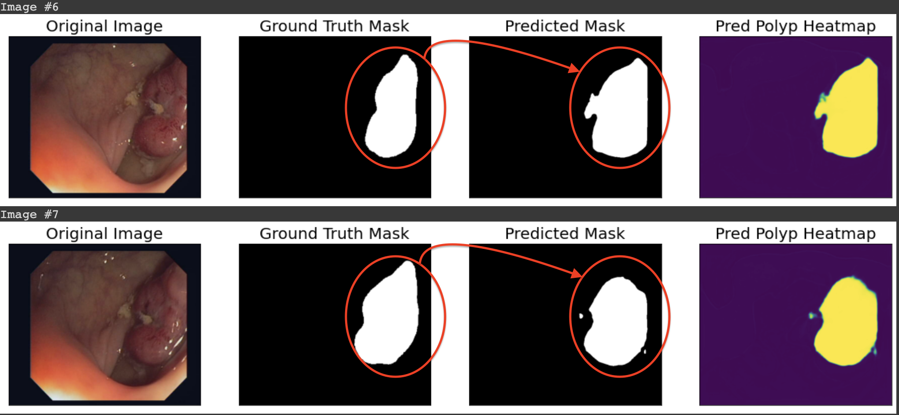
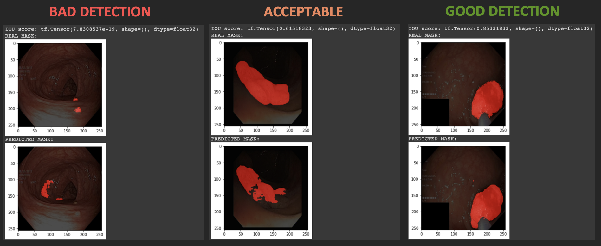

# Polyps classification on colonoscopy images via deep learning

__Author__: Fernández Hernández, Alberto.

__Date__: 2022-01-09

__In progress...__

# __Summary__

The main purpose of this project is:

## "Offline" Polyps segmentation using traditional U-Net model

| Data type | IoU score |
| --------- | --------- |
| _train_ | 0.9589 | 
| _val_ | 0.9563 |  
| _test_ | 0.9219 |

## What if we employ a lightweight model?

__First approach__: MobileNet_v2 architecture - NanoNet version

__Number of parameters__: ~284 K parameters. 

__Intersection over Union score (IoU)__:

| Data type | IoU score |
| --------- | --------- |
| _train_ | 0.7605 | 
| _val_ | 0.7117 |  
| _test_ | 0.7384 |

# References

[NanoNet: Real-Time Polyp Segmentation in Video Capsule Endoscopy and Colonoscopy](https://github.com/DebeshJha/NanoNet)

[Deep Neural Networks approaches for detecting and classifying colorectal polyps](https://www.researchgate.net/publication/341345834_Deep_Neural_Networks_approaches_for_detecting_and_classifying_colorectal_polyps)
